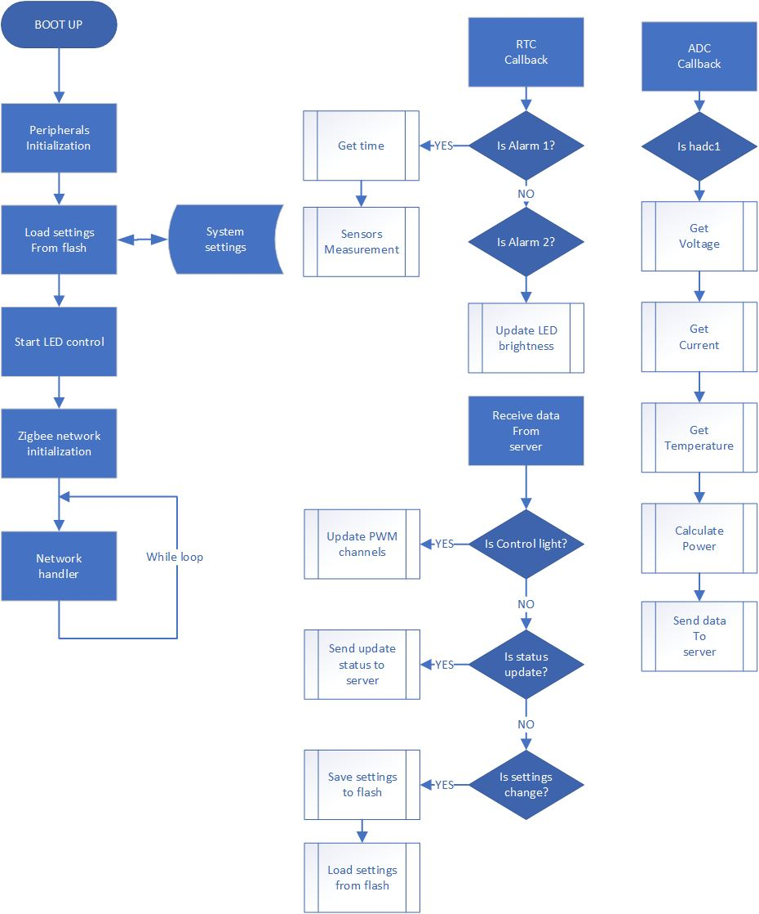

<a name="readme-top"></a>

<br />
<div align="center">   
  </a>

  <h3 align="center">IoT-based LED controller</h3>

</div>


<!-- TABLE OF CONTENTS -->
<details>
  <summary>Table of Contents</summary>
  <ol>
    <li>
      <a href="#about-the-project">About The Project</a>
    </li>
    <li>
      <a href="#how-to-use-it">How to use it</a>
    </li>
    <li>
      <a href="#server">Server</a>
      <ul>
        <li><a href="#hardware">Hardware</a></li>
        <li><a href="#frontend">Frontend</a></li>
        <li><a href="#backend">Backend</a>
          <li><a href="#node.js">Node.js</a></li>
          <li><a href="#express.js">Express.js</a></li>
          <li><a href="#mosquitto">Mosquitto</a>
          <li><a href="#zigbee2mqtt">Zigbee2MQTT</a>
          <li><a href="#nginx">Nginx</a>
        </li>
      </ul>
    </li>
    <li>
      <a href="#controller-board">Controller board</a>
    </li>
     <li>
      <a href="#driver-board">Driver board</a>
    </li>
  </ol>
</details>

# About The Project
The goal of this project is to build a universal IoT-based grow light LED controller. The core of the system is a Raspberry Pi-based gateway that coordinates the network and interfaces with a user control panel for data collection and system management. The system is designed for offline use, but can easily be deployed to the cloud. A key feature of the system is the independence of the controllers, which can operate autonomously while the server manages data collection and setting updates. The controller is designed to be a universal device, adaptable to varying requirements of LED diodes, spectrum, and power in agricultural applications.
<div align="center">
    
    </a>
</div>

# How to use it
Below, you will find the requirements, suggestions, and configuration code for each module. Feel free to reach out inc ase of any problems or questions.

<p align="right">(<a href="#readme-top">back to top</a>)</p>

# Server
I've decided to separate backend and fronted. This is my setup:

- The React app is built and served by a web server (Nginx) as static files, delivering the frontend assets (HTML, CSS, JS) to the browser.
- The Node.js server runs separately, listening on a different port, and provides the API that the React app consumes.

## Hardware
**Raspberry Pi **
I've used an RPI 4, but other models should work. I recommend using a 64-bit OS like Debian, as MongoDB requires a 64-bit environment. While the project is configured for offline use, deploying to the cloud is possible and potentially easier.

## Frontend
- React.js 
- Material UI

**React.js**
<div align="center">
    
    </a>
</div>

**Installation**
1. On RPI:
```bash
mkdir react-app-remote
cd react-app-remote
git init --bare
```
2. On PC add the Raspberry Pi directory as a remote repository: `git remote add rpi pi@raspberry-pi-ip-address:/path/to/react-app-remote`

Note: I haven't implemented all features due to lack of time. At the moment, users can control LED channels, select LED profiles, and configure and schedule light times.
Here is a simple demo:

[](https://www.youtube.com/watch?v=QfmdE5aYiLI)

## Backend
- Node.js
- Express.js
- Nginx
- MongoDB
- Mosquitto
- Zigbee2MQTT

Here is a basic flowchart of the MQTT service working on the backend:
<div align="center">
    
    </a>
</div>

### Node.js
`sudo apt-get install -y nodejs npm`
### Express.js
`sudo npm install express --save`
### Mosquitto
Mosquitto is an open-source MQTT broker that provides efficient communication between IoT devices. It manages message publications and subscriptions across devices.

Key Components:

- Broker: Manages message distribution between devices.
- Clients: Devices that communicate by sending and receiving messages.
- Topics: Messages are categorized using topics, which clients can publish or subscribe to.

<div align="center">
    
    </a>
</div>

**Installing**
1. `sudo apt install mosquitto mosquitto-clients`.
2. `sudo systemctl start mosquitto` or `mosquitto`.
3. To start it on boot: `sudo systemctl enable mosquitto`.

### Zigbee2MQTT
Zigbee2MQTT bridges the gap between Zigbee devices and MQTT, allowing Zigbee device data to be published directly to an MQTT broker. This eliminates the need for proprietary bridges, offering a more unified, open-source solution that integrates well with the backend stack.

I've used SONOFF USB dongle, but installation may vary for different devices.

**Installation**
1. Verify the location of the USB dongle - `ls /dev/ttyACM*` or `ls -l /dev/ttyACM0`.
2. However, it is recommended to use "by ID" mapping of the device (see [Adapter settings](https://www zigbee2mqtt.io/guide/configuration/adapter-settings.html)). This kind of device path mapping is more stable, but can also be handy if you have multiple serial devices connected to your Raspberry Pi. In the example below the device location is: `/dev/serial/by-id usb-Texas_Instruments_TI_CC2531_USB_CDC___0X00124B0018ED3DDF-if00`.

```bash
jacek@raspberrypi:~ $ ls -l /dev/serial/by-id
total 0
lrwxrwxrwx 1 root root 13 Sep  9 14:05 usb-STMicroelectronics_STM32_Virtual_ComPort_in_FS_Mode_FFFFFFFEFFFF-if00 -> ../../ttyACM0
```
Here is an installation I've found somewhere on internet:
```bash
# Set up Node.js repository and install Node.js + required dependencies
# NOTE 1: Older i386 hardware can work with [unofficial-builds.nodejs.org](https://unofficial-builds.nodejs.org/download/release/v16.15.0/ e.g. Version 16.15.0 should work.
# NOTE 2: For Ubuntu see tip below
sudo curl -fsSL https://deb.nodesource.com/setup_16.x | sudo -E bash -
sudo apt-get install -y nodejs git make g++ gcc

# Verify that the correct nodejs and npm (automatically installed with nodejs)
# version has been installed
node --version  # Should output v14.X, V16.x, V17.x or V18.X
npm --version  # Should output 6.X, 7.X or 8.X

# Create a directory for zigbee2mqtt and set your user as owner of it
sudo mkdir /opt/zigbee2mqtt
sudo chown -R ${USER}: /opt/zigbee2mqtt

# Clone Zigbee2MQTT repository
git clone --depth 1 https://github.com/Koenkk/zigbee2mqtt.git /opt/zigbee2mqtt

# Install dependencies (as user "pi")
cd /opt/zigbee2mqtt
npm ci

# Build the app
npm run build
```

Unfortunately connecting custom devices to the brokers is not as straightforward as connecting off the shelf products. A custom definition is added to the broker:

``` js
const fz = require('zigbee-herdsman-converters/converters/fromZigbee');
const tz = require('zigbee-herdsman-converters/converters/toZigbee');
const exposes = require('zigbee-herdsman-converters/lib/exposes');
const reporting = require('zigbee-herdsman-converters/lib/reporting');
const extend = require('zigbee-herdsman-converters/lib/extend');
const e = exposes.presets;
const ea = exposes.access;
const definition = {
    zigbeeModel: ['STM32WB'], // The model ID
    model: 'WB55', //
    vendor: 'STMicroelectronics',
    description: 'STM32 mcu board for zigbee',
    extend: extend.light_onoff_brightness(),
    exposes: [
        e.light_onoff_brightness().withEndpoint('button_1'),
        e.light_onoff_brightness().withEndpoint('button_2'),
        e.light_onoff_brightness().withEndpoint('button_3'),
        e.light_onoff_brightness().withEndpoint('button_4'),
        e.light_onoff_brightness().withEndpoint('button_5'),
        e.light_onoff_brightness().withEndpoint('button_6')
    ],
    endpoint: (device) => {
        return {
            'button_1': 17,
            'button_2': 20,
            'button_3': 21,
            'button_4': 22,
            'button_5': 23,
            'button_6': 24
        };
    },
    meta: {multiEndpoint: true},
};
module.exports = definition;
```

**Starting Zigbee2MQTT**
``` bash
cd /opt/zigbee2mqtt
npm start
```

## Nginx
Nginx is a high-performance HTTP server and reverse proxy server. It's configured as a reverse proxy to forward requests to the Node.js server. It also handles SSL/TLS termination and serves static assets. Nginx is chosen for its speed, stability, and low resource consumption, making it an ideal choice for the Raspberry Pi environment.

**Installation**
1. `sudo apt install nginx`.
2. To start it: `sudo /etc/init.d/nginx start`.
3. There should be a welcome page when `IP` is typed in the browser.
4. Check the process with ` systemctl status nginx`.
5. To ensure Nginx starts automatically at boot: `sudo systemctl enable nginx`.

**Configuration**
1. On RPi create or edit default configuration file: `sudo nano /etc/nginx/sites-available/react-app`:
``` bash
server {
    listen 80;
    server_name your-rpi-ip-address;
    location / {
        root /path/to/your/react/app/build;
        try_files $uri /index.html;
    }
}
```
2. Replace `/path/to/your/react/app/build` with the actual path to the `build` directory of your React app on the Raspberry Pi.
3. Activate config file: `sudo ln -s /etc/nginx/sites-available/react-app /etc/nginx/sites-enabled/`.
4. Restart: `sudo systemctl restart nginx`.

# Controller board
The basic flowchart of the controller system is shown in diagram below:

<div align="center">
    
    </a>
</div>

During boot-up, all necessary peripherals (timers, ADC, RTC, and RF modules) are initialized. After peripheral setup, settings are loaded from flash memory, and the LED control begins. The main loop handles networking, while driver management and sensor measurements use interrupts. Real-time tasks are scheduled using the RTC (Real-Time Clock), synchronized with the server.

The RTC has two alarms:

- Alarm A: Initially triggered after 5 seconds, then every 10 seconds (for development purposes; can be changed for real applications).
- Alarm B: Updates PWM channels every 15 minutes (can be adjusted to 1 hour but would reduce smoothness in brightness transitions).

<div align="center">
    
    </a>
</div>
<div align="center">
    
    </a>
</div>
<div align="center">
    
    </a>
</div>

**Power supply**
The system is powered by a 24V supply, which contains reverse polarity protection. Current monitoring is performed using the MAX4080, a current-sensing amplifier. It operates by translating a current flowing through a shunt resistor into a proportional voltage, which is then amplified for easy monitoring and feedback. Ideally, to achieve the full scale, the maximum load current that is measured should be used for choosing the gain. In this design 5A load is translated to 2.5V. The model used in the project is MAX4080T – which has 20V/V gain. To calculate the full-scale output voltage:
$$V_{\text{OUT}} = R_{\text{SENSE}} \times I_{\text{LOAD(MAX)}} \times A_V$$

The 12V supply powers a fan and 3.3V rail through a step-down regulator (LMR33620ADDA), and soft start functionality protects against inrush current by delaying the driver board's activation.

**Microcontroller**
The heart of the system is the microcontroller STM32WB55RGV. It has a few decoupling capacitors and two crystals. The SWDIO and SWCLK lines provide the programming and debug interface. External reference voltage can be connected or disconnected with 0Ω resistors. It provides a reference voltage of 2.5V.
Settings are stored in the internal memory of the microcontroller, which has a write endurance of 10,000 cycles—sufficient for typical use.

<div align="center">
    
    </a>
</div>

**Power supplly for the driver PCB**
There is a 24V rail used to power the control board, and the additional circuit creates a 24V soft start power rail. This rail is used to power the driver board. The soft start allows for a delay, before enabling the driver board. Large capacitors can be used on a driver board, which
can create inrush current. In some cases, it could be enough to trip the power protection used on the switch mode power supply that powers the microcontroller. The LED driver board is powered through the 1kΩ resistor (R8). At some preset time that resistor is being shorted by the MOSFET.

**PWM, Fans, and RF**
The fan interface section is designed for 4 pins type of fan. There is a PWM input generating signal at a frequency of 25kHz, which is commonly used in the industry. The PWM pin is connected through an open collector transistor. There is a 12V supply for a fan and a ground. The tachometer signal goes through the resistor network to the microcontroller. It is not necessary to use it, therefore 3 pin types of fans can also be used.

PWM buffer uses SN74HC365D from Texas Instruments. It has six buffers with 3-state outputs. All channels are placed into the high impedance state, when either of the output enable pins are set to high. The reason why the buffer is used is that sometimes microcontrollers can toggle some of the pins, particularly while booting up. The PWM outputs are disabled until everything is up and running.

The RF antenna used is the M830520. Impedance matching is required for the antenna to reduce signal loss. A top-layer track on the PCB is used for components and signal routing, and the bottom layer is mostly ground. Matching network without proper calibration tools can be a difficult task. To simplify the problem an integrated impedance matching circuit is used. It has a 50Ω nominal impedance on the antenna side.

<div align="center">
    
    </a>
</div>


MLPF-WB55-02E3 has a very small package and high requirements for PCB design. To make a track between the matching circuit and antenna with an acceptable width when 2-layer PCB is used, the thickness should not be higher than 1mm. The top layer on the designed PCB is used for components and signal routing. The bottom layer mainly is covered with ground. The thickness of the RF track is calculated for the coplanar wave guide with ground. I suggest using a microcontroller with an RF circuit.

<div align="center">
    
    </a>
</div>

<p align="right">(<a href="#readme-top">back to top</a>)</p>

# Driver board
The controller board design and power supply considerations allow for using different versions of the LED driver board. There are certain requirements that need to be met by the driver board. The maximum size of the PCB is 176mm x 52mm. Although there are no reasons to using larger PCB, only the enclosure would need to be resized.
The controller board has a fixed number of header pins that are also used by the LED driver board. There are 4 power pins, 3 pins used by temperature sensor, 4 pins used by the fan, and 6 pins dedicated to PWM channels. The placement of the header pins needs to be always followed. The LED driver board uses the male version of the header pins, with a pitch of 2.54mm. 

The LED driver board is based on buck topology using the AL8843Q. It has four LED drivers, each with different current limits. The maximum current is 7A. Both fans and temperature sensors can be connected.

<div align="center">
    
    </a>
</div>
<div align="center">
    
    </a>
</div>


AL8843Q chosen for this project is an integrated hysteresis mode DC-DC step down converter that can provide up to 60W of output power. It can supply with a voltage between 4.5V and 40V. The current output is adjustable and can be set up to 3A. 


<div align="center">
    
    </a>
</div>

<p align="right">(<a href="#readme-top">back to top</a>)</p>


